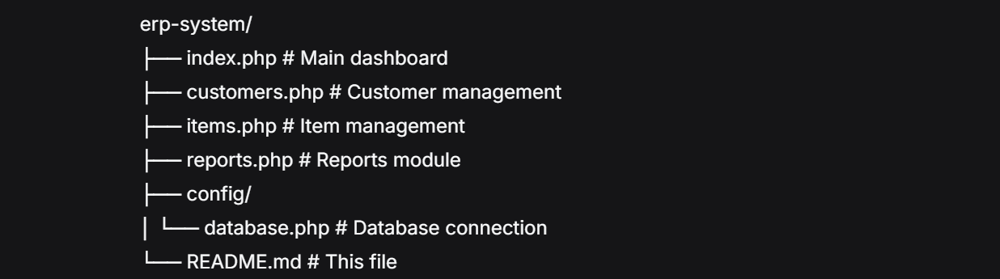

### ERP System

A simple ERP system built with PHP and MySQL for customer, item, and invoice management.
A complete Enterprise Resource Planning (ERP) system built with PHP and MySQL for managing customers, inventory, and business reports.

## Features
- Customer Management (Add, View, Delete)
- Item Management (Add, View, Delete) 
- Basic Reports (Invoice, Invoice Items, Item Reports)
- Bootstrap UI
- MySQL Database

## Setup Instructions

### Prerequisites
- XAMPP/WAMP installed
- PHP 7.4 or higher
- MySQL

### Installation
1. Place the project folder in your `htdocs` (XAMPP) or `www` (WAMP) directory
2. Start Apache and MySQL from XAMPP/WAMP control panel
3. Open phpMyAdmin (`http://localhost/phpmyadmin`)
4. Create a new database named `erp_system`
5. Import the SQL structure from the provided database file or run the table creation queries
6. Open `http://localhost/erp-system` in your browser

## Assumptions Made
- Basic form validation implemented (required fields)
- Using Bootstrap CDN for styling
- Simple delete functionality without soft delete
- Invoice module would be implemented in phase 2
- No user authentication implemented
- District field is free text (not dropdown)

## Project Structure




## Database Tables
- customers (id, title, first_name, last_name, contact_number, district, created_at)
- items (id, item_code, item_name, category, sub_category, quantity, unit_price, created_at)
- invoices (id, invoice_number, invoice_date, customer_id, total_amount, created_at)
- invoice_items (id, invoice_id, item_id, quantity, unit_price, total_price)

### Local Development Links


Main Pages:
```bash
http://localhost/erp-system/
http://localhost/erp-system/index.php
http://localhost/erp-system/customers.php
http://localhost/erp-system/items.php
http://localhost/erp-system/reports.php
```

Database Management:
```bash
http://localhost/phpmyadmin/
```

Database Connection:
```bash
php
// In config/database.php
require_once 'config/database.php';
```
